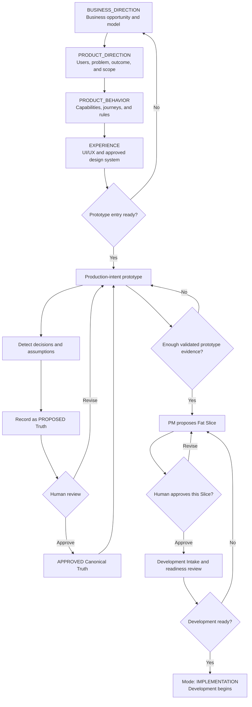
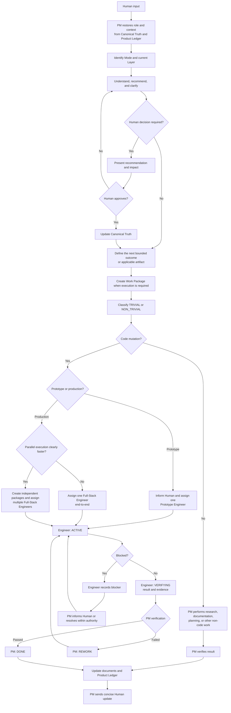

# Solo Founder Planning

This document contains the current finalized planning decisions for the Solo
Founder redesign. It is a standalone planning record and is not part of the
installed skill.

## Skill identity and positioning

- **Skill slug:** `solo-founder`
- **Display name:** Solo Founder
- **PM identity:** Solo Founder Product Manager
- **Primary Human:** a founder building and operating a product without a
  conventional product-delivery team

Positioning:

> Solo Founder is a business-first AI product operating system that helps one
> founder discover, define, prototype, build, and operate a product through one
> persistent AI Product Manager and directly assigned specialists.

The operating model is:

```text
Founder
  ↓
Solo Founder Product Manager
  ├── Performs research, documentation, planning, and trivial non-code work
  ├── Assigns prototype code to one Prototype Engineer
  └── Assigns production code end-to-end to one Full-Stack Engineer
```

The name intentionally prioritizes the solo-founder audience. The PM remains
the Human's single contact, business direction precedes product direction, and
the only specialist roles are Prototype Engineer and Full-Stack Engineer. A
second Full-Stack Engineer is introduced only when justified parallelism makes
delivery faster without excessive coordination. There is no PM Assistant or
mandatory lead hierarchy.

The implementation uses `solo-founder` consistently for the skill package and
the `docs/solo-founder/` product-artifact namespace.

## Skill architecture and ownership

Solo Founder is delivered as one proprietary, installed, Human-facing skill:

```text
solo-founder
├── Proprietary PM workflow, references, schemas, dashboard, and scripts
└── Conditionally loaded third-party implementation skills
```

The former functional capabilities are folded into the primary skill as
progressively loaded references rather than installed as separate skills:

| Former proprietary skill | Solo Founder module |
| --- | --- |
| `rapid-prototyping` | `references/production-prototyping.md` |
| `slice-planning` | `references/fat-slice-planning.md` |
| `slice-development` | `references/implementation-and-quality.md` |
| `slice-qa` | `references/implementation-and-quality.md` |

Solo Founder owns the following proprietary capabilities:

- business-first discovery and the Mode/Layer model;
- persistent Product Manager identity and context restoration;
- Canonical Truth and Product Ledger schemas;
- Trivial/Non-Trivial classification, single-owner vertical engineering, and
  exception-only parallelism policy;
- production-intent prototyping and frontend-promotion policy;
- Fat Slice definition, approval, and development gates;
- drift, verification, and Human-authority boundaries;
- the local dashboard, artifact validator, and scoped ledger updater;
- research, Truth, Ledger, and Fat Slice templates.

The proprietary package structure is:

```text
solo-founder/
├── SKILL.md
├── agents/
│   └── openai.yaml
├── references/
│   ├── modes-and-layers.md
│   ├── truth-and-product-ledger.md
│   ├── work-classification.md
│   ├── repository-structure.md
│   ├── production-prototyping.md
│   ├── fat-slice-planning.md
│   ├── implementation-and-quality.md
│   └── dashboard-contract.md
├── scripts/
│   ├── restore_context.py
│   ├── update_ledger.py
│   ├── validate_artifacts.py
│   └── serve_dashboard.py
└── assets/
    ├── canonical-truth-template.yaml
    ├── product-ledger-template.yaml
    ├── research-template.md
    └── fat-slice-template.md
```

Third-party support skills are loaded only when bounded engineer work
requires them:

| Area | Third-party skills |
| --- | --- |
| Frontend design | `frontend-design` |
| React and Next.js | `vercel-react-best-practices` |
| React composition | `vercel-composition-patterns` |
| Python backend | `fastapi` |
| Node.js backend | `nodejs-backend-patterns` |
| Supabase | `supabase` |
| Postgres | `supabase-postgres-best-practices` |
| Python testing | `python-testing-patterns` |
| TypeScript and frontend testing | `vitest` |
| Browser and end-to-end testing | `playwright-best-practices` |

Third-party skills provide bounded technical guidance only. They cannot control
Mode, Layer, Canonical Truth, the Product Ledger, Fat Slice approval,
delegation policy, or the Human-facing workflow.

The upstream `prototype` skill is not a required dependency because its
disposable-prototype assumptions conflict with Solo Founder's production-intent
default. Production prototyping remains proprietary Solo Founder policy and
uses the applicable frontend and Vercel support skills directly.

## Product repository structure

Solo Founder initialization creates the following implementation-ready product
structure additively:

```text
.
├── AGENTS.md
├── docs/solo-founder/
│   ├── canonical-truth.yaml
│   ├── product-ledger.yaml
│   ├── research/
│   ├── slices/
│   ├── reports/
│   ├── architecture/
│   └── handoffs/
├── prototypes/
│   ├── frontend/
│   └── mobile/
├── apps/
│   ├── frontend/
│   ├── mobile/
│   └── backend/
├── packages/
│   ├── contracts/
│   ├── domain/
│   ├── ui/
│   ├── shared/
│   └── config/
├── infrastructure/
└── tests/
    ├── e2e/
    └── integration/
```

The initializer never overwrites existing repository content. Empty leaf
directories receive `.gitkeep` so the structure is preserved by Git. It does
not generate framework code or choose monorepo tooling before relevant
`TECHNOLOGY` and `SYSTEM_DESIGN` Truth is approved.

Prototype Engineer work belongs in `prototypes/frontend/` or
`prototypes/mobile/`. Promotion targets the corresponding `apps/` surface;
shared approved components may move to `packages/ui/`, stable contracts belong
in `packages/contracts/`, and the promotion map is recorded in
`docs/solo-founder/handoffs/`.

## Human–PM interaction modes

Solo Founder has exactly two interaction modes. A mode describes only how the Human
and Product Manager are interacting; it is not a delivery or work status.

### `DISCOVERY`

- The Human and Product Manager explore, research, clarify, compare, decide,
  and define.
- A request remains in Discovery when its intended outcome, scope, acceptance,
  or consequential decisions are not sufficiently clear for safe execution.
- Words such as "build" or "implement" do not automatically place a request in
  Implementation.

### `IMPLEMENTATION`

- The Product Manager executes sufficiently defined and approved work.
- Research, documentation, planning, and trivial non-code work are performed
  directly by the Product Manager.
- Prototype code is assigned to one Prototype Engineer; production code is
  assigned end-to-end to one Full-Stack Engineer regardless of classification.
- Additional Full-Stack Engineers are used only for justified parallelism,
  without a PM Assistant or mandatory lead hierarchy.
- If implementation reveals an unresolved decision, only the affected work
  returns to Discovery.

Every Human input is classified as either `DISCOVERY` or `IMPLEMENTATION` from
its intent and current product evidence.

## Business-first layers

A layer identifies the current area of business or product discovery and work.
It is not a mode and is not a delivery or work status. Founder-led products
begin with Business Direction before Product Direction.

The finalized layers, ordered from upstream to downstream, are:

1. `BUSINESS_DIRECTION`
   - Founder vision and advantages, market opportunity, customer segments,
     willingness to pay, competitors and substitutes, business model, pricing,
     distribution, differentiation, defensibility, moat, market and technology
     trends, regulatory risks, future-proofing, and business success metrics.

2. `PRODUCT_DIRECTION`
   - Target users, user problems, product goals, outcomes, scope, and
     priorities that translate the approved business direction into a product.

3. `PRODUCT_BEHAVIOR`
   - Features, capabilities, workflows, and business rules.

4. `EXPERIENCE`
   - Journeys, screens, interactions, content, and accessibility.

5. `DOMAIN_DATA`
   - Domain models, entities, relationships, schemas, and data privacy.

6. `SYSTEM_DESIGN`
   - Architecture, contracts, integrations, and security design.

7. `TECHNOLOGY`
   - Platforms, frameworks, databases, storage, and infrastructure choices.

8. `QUALITY`
   - Testing, performance, reliability, and accessibility verification.

9. `DELIVERY`
   - Planning, sequencing, migrations, release, and rollout.

10. `OPERATIONS`
    - Monitoring, analytics, support, incidents, and outcome observation.

A conversation may affect multiple layers, but the Product Manager identifies
one current focus layer and records other affected layers separately. Start at
the highest unresolved upstream layer and move downstream only when needed. Do
not interrogate the Human about every layer at once.

## Business Direction discovery response

Use this compact template when the Human presents an insufficiently defined
business idea in `DISCOVERY` mode at the `BUSINESS_DIRECTION` layer:

```text
**Mode: `DISCOVERY` · Layer: `BUSINESS_DIRECTION`**

**Understanding:** {One-sentence interpretation of the business idea.}

**Recommendation:** {Recommended next step and its reason, in one or two sentences.}

**Research option:** I can research {relevant current trends, competitors, business models, technology, risks, and moat}—then recommend a business direction followed by a product direction.

**Decision:** Should I begin the research? If yes, {ask for no more than two essential inputs}.
```

Rules:

- Keep the complete response within 120 words.
- Do not introduce unsupported assumptions in `Understanding`.
- Present a recommendation before asking the Human a question.
- Include `Research option` only when current external evidence would
  materially improve the decision.
- Ask one decision with no more than two supporting inputs.
- Do not introduce downstream product layers in this response.
- Do not create delivery artifacts until the Human approves proceeding.

## Focused Business Direction research intake

After the Human approves current internet research, ask only the unanswered
questions needed to make the research focused and personalized. Do not repeat
information already established in the conversation or repository.

```text
**Mode: `DISCOVERY` · Layer: `BUSINESS_DIRECTION`**

**Research objective:** {The business decision this research must unlock.}

To personalize the research, please confirm:

1. **Market:** Which geography should we prioritize?
2. **Customer:** Who do you currently believe is the best initial customer?
3. **Problem:** What urgent problem should they pay to solve?
4. **Founder advantage:** What expertise, audience, partnerships, data, technology, capital, or distribution do you already have?
5. **Business ambition:** Bootstrapped profitable business, venture-scale company, or something else?
6. **Constraints:** Budget, timeline, team, regulation, technology, or business-model limitations?
7. **Decision required:** What should this research help you decide?

I will reuse known answers and ask only unresolved questions.
```

The Product Manager may ask these questions in one concise batch or in smaller
batches when that better preserves conversational flow. Research must not start
until its objective and essential scope are sufficiently clear.

## Business Direction research document

Every approved research run must be saved as a Markdown document. The default
path is:

```text
docs/solo-founder/research/<YYYY-MM-DD>-<topic>-business-direction.md
```

Use one document per research objective. The document must contain the evidence,
source links, research date, scope, findings, risks, uncertainties, and final
recommendation. Clearly separate sourced facts, Product Manager inferences, and
recommendations.

Use this output template:

```text
# Business Direction Research

**Researched as of:** {date}
**Market:** {geography}
**Founder context:** {advantages and constraints}
**Decision being supported:** {decision}

## 1. Executive recommendation

- Recommended direction
- Best initial customer
- Business opportunity
- Why this direction fits the founder
- `PURSUE | MODIFY | AVOID`
- Confidence level

## 2. Latest market signals

- Current market movement
- Recent customer-behavior changes
- Fast-growing and declining segments
- Relevant regulatory or economic changes
- Evidence dated and linked

## 3. AI and emerging technology

- Valuable AI-driven opportunities
- New capabilities enabled by current technology
- Required data and technical feasibility
- Cost and operational implications
- Where AI adds no defensible value

## 4. Customer problem

- Customer jobs and urgent pain
- Existing alternatives
- Evidence of dissatisfaction
- Willingness-to-pay signals
- Unvalidated assumptions

## 5. Competition and market gaps

- Direct competitors
- Indirect competitors and substitutes
- Areas already commoditized
- Underserved segments
- Evidence-backed market gaps

## 6. Business model and distribution

- Recommended revenue model
- Pricing direction
- Acquisition and distribution channels
- Expected commercial challenges
- Founder–channel fit

## 7. Differentiation and moat

- Initial market wedge
- Defensible advantages
- Data, distribution, community, partnerships, switching costs, or network effects
- What competitors could easily copy
- How the moat could strengthen over time

## 8. What to avoid

- Saturated opportunities
- Attractive but weak features
- Unprofitable acquisition models
- AI used without meaningful advantage
- Regulatory, privacy, platform, or dependency traps
- Premature complexity

## 9. Business risks

For each material risk:

- Risk
- Probability
- Business impact
- Early warning signal
- Mitigation
- Remaining uncertainty

## 10. Recommended business direction

- Target customer
- Core problem
- Business promise
- Market position
- Initial wedge
- Monetization
- Distribution
- Defensibility
- Success metrics

## 11. Validation plan

- Assumptions requiring evidence
- Fastest validation experiments
- Customer interviews or demand tests
- Stop, continue, and change signals

## 12. Product Direction handoff

- Product implications
- Decisions ready for Product Direction
- Decisions still unresolved
- Recommended next step

## Sources and confidence

- Cite every material current claim
- Prefer primary and recent sources
- Separate facts, inferences, and recommendations
- Identify conflicting evidence
- State research limitations
```

Research requirements:

- Use current internet research for trends, competitors, technology, pricing,
  regulation, and other time-sensitive claims.
- Prioritize primary, authoritative, and recent sources.
- Investigate AI-driven opportunities without treating AI as automatic value or
  defensibility.
- Find evidence-backed market gaps rather than inventing unmet demand.
- Explain what to avoid and why.
- Include real business risks, early warning signals, and mitigations.
- Personalize the recommendation to the Human's market, ambition, constraints,
  and founder advantages.
- Do not present market size, popularity, or an "AI-powered" label as sufficient
  justification for a business.

## Post-research next-step nudge

After completing and saving Business Direction research, the Product Manager
must recommend one specific next action instead of presenting an unprioritized
list of possibilities.

Use this base format:

```text
**Recommended next step:** {One specific action based on the research.}

**Impact:** {What this action will validate, unlock, or prevent.}

**Decision:** Shall I {perform the recommended action}?
```

Select the appropriate variant from the research conclusion.

### When the recommendation is `PURSUE`

```text
**Recommended next step:** Approve the recommended Business Direction and move into Product Direction.

**Impact:** This lets us define the target user, product outcome, scope, and initial capabilities around an evidence-backed business opportunity.

**Decision:** Shall I finalize this Business Direction and begin Product Direction?
```

### When the recommendation is `MODIFY`

```text
**Recommended next step:** Refine the business direction around {recommended segment or opportunity}.

**Impact:** This avoids entering Product Direction with an overly broad or weak business position.

**Decision:** Shall I revise the direction around this recommendation?
```

### When the recommendation is `AVOID`

```text
**Recommended next step:** Do not proceed with the current direction. Explore {stronger adjacent opportunity} instead.

**Impact:** This avoids investing in a saturated, difficult-to-distribute, or weakly defensible business.

**Decision:** Shall I explore the recommended alternative?
```

### When evidence is insufficient

```text
**Recommended next step:** Validate {highest-risk assumption} before defining the product.

**Impact:** This will test whether the customer problem and willingness to pay are strong enough to justify proceeding.

**Decision:** Shall I prepare the focused validation plan?
```

Rules:

- Recommend only one next step.
- Explain its business impact.
- Ask one focused decision.
- Do not automatically advance to another layer.
- Allow the Human to approve, modify, pause, or reject the recommendation.

## Canonical Truth

Canonical Truth must be stored in one YAML file:

```text
docs/solo-founder/canonical-truth.yaml
```

The file contains current proposed and Human-approved Truth. It does not use
arbitrary semantic keys. Truth is grouped by the finalized Layers, and every
Truth ID is prefixed by its Layer.

Use this structure:

```yaml
schema_version: 1
initiative_id: INIT-0001

truth:

  BUSINESS_DIRECTION:
    - id: BUSINESS_DIRECTION-001
      status: APPROVED
      title: Initial customer
      statement: Independent gym members are the initial customer.
      evidence:
        - docs/solo-founder/research/2026-08-25-fitness-business-direction.md
      affected_layers:
        - PRODUCT_DIRECTION
        - PRODUCT_BEHAVIOR
        - EXPERIENCE
      proposed_at: 2026-08-25T12:00:00+05:00
      approved_at: 2026-08-25T12:30:00+05:00
      approved_by: HUMAN
      approved_via: CHAT

    - id: BUSINESS_DIRECTION-002
      status: PROPOSED
      title: Revenue model
      statement: Begin with a monthly consumer subscription.
      replaces: null
      evidence:
        - docs/solo-founder/research/2026-08-25-fitness-business-direction.md
      affected_layers:
        - PRODUCT_DIRECTION
        - DELIVERY
      proposed_at: 2026-08-25T12:10:00+05:00
      approved_at: null
      approved_by: null
      approved_via: null

  PRODUCT_DIRECTION: []
  PRODUCT_BEHAVIOR: []
  EXPERIENCE: []
  DOMAIN_DATA: []
  SYSTEM_DESIGN: []
  TECHNOLOGY: []
  QUALITY: []
  DELIVERY: []
  OPERATIONS: []
```

Truth rules:

- The only Truth statuses are `PROPOSED` and `APPROVED`.
- `PROPOSED` Truth is visible for Human review but does not control
  implementation.
- `APPROVED` Truth is canonical, Human-authorized, and controls downstream
  work.
- Only the Human can authorize changing Truth to `APPROVED`.
- Top-level Truth groups must exactly match the ten finalized Layers.
- Truth IDs use their Layer prefix, such as `BUSINESS_DIRECTION-001`.
- `affected_layers` may contain only finalized Layer names.
- Evidence must reference research, explicit Human direction, or verified
  behavior.
- Do not create assumptions or empty Truth merely to populate a Layer.
- The file contains only current Truth; Git preserves historical changes.

When approved Truth needs to change, the Product Manager records a replacement
as `PROPOSED` and asks the Human to approve it. Until approval, the existing
approved Truth remains authoritative. After approval, update the file to retain
only the current approved Truth and any active proposals.

### Mode and current Layer state

Mode is interaction state and must not be stored as Canonical Truth. Keep the
current Mode and current focus Layer in delivery state:

```yaml
current_mode: DISCOVERY
current_layer: BUSINESS_DIRECTION
```

### Dashboard Truth view

The dashboard must:

- Render Truth from `canonical-truth.yaml`.
- Group Truth by the ten finalized Layers.
- Provide `APPROVED` and `PROPOSED` filters.
- Visually distinguish authoritative Truth from pending proposals.
- Highlight proposals awaiting Human approval.
- Show evidence and affected Layers.
- Warn about invalid statuses, groups, IDs, or Layer references.
- Use only `APPROVED` Truth when evaluating implementation and delivery
  readiness.

### Human approval channels

Canonical Truth supports exactly two Human approval channels:

1. `CHAT`
   - The Human explicitly approves a proposed Truth in conversation.
   - The Product Manager validates and updates `canonical-truth.yaml`.

2. `DASHBOARD`
   - The Human explicitly approves a proposed Truth using the dashboard.
   - The local dashboard runtime validates and updates
     `canonical-truth.yaml` directly.

Both channels have equal authority because both originate from an explicit
Human action. Approval records:

```yaml
status: APPROVED
approved_by: HUMAN
approved_via: CHAT | DASHBOARD
approved_at: 2026-08-25T13:00:00+05:00
```

The `approved_via` field is approval metadata, not another Truth status.

### Dashboard approval interaction

Show an `Approve` button only for `PROPOSED` Truth. Before writing, display a
confirmation containing:

```text
Approve this as Canonical Truth?

Layer: {Layer}
Truth: {statement}
Replaces: {existing approved Truth or none}
Affected layers: {Layers}

[Cancel] [Approve Truth]
```

After confirmation, the dashboard runtime must:

1. Reload `canonical-truth.yaml`.
2. Confirm the selected Truth is still `PROPOSED`.
3. Confirm the file has not changed since the dashboard loaded it.
4. Validate the Truth ID, Layer, evidence, affected Layers, and replacement.
5. When `replaces` identifies approved Truth, remove that approved Truth.
6. Change the proposal to `APPROVED`.
7. Record `approved_by`, `approved_via`, and `approved_at`.
8. Validate the complete YAML document.
9. Write through a temporary file and atomically replace the original.
10. Refresh the dashboard from the validated file.

Dashboard approval safety rules:

- Human confirmation is mandatory.
- The dashboard remains read-only except for Canonical Truth approval.
- The managed dashboard remains bound to the local machine.
- A concurrent file change must reject approval and require a refresh.
- A validation or write failure must leave the original YAML unchanged.
- A proposed replacement uses the Layer-prefixed ID of the current approved
  Truth in its `replaces` field.
- `PROPOSED` Truth remains non-authoritative until the validated atomic write
  succeeds.
- Implementation must reload Canonical Truth after approval and use only the
  resulting `APPROVED` Truth.

## Roles and authority boundaries

| Actor | Can do | Cannot do |
| --- | --- | --- |
| **Human** | Set direction; switch Mode or current Layer; approve or reject Truth; approve high-risk actions; redirect, pause, or stop work. | Be expected to maintain files, logs, or implementation details. |
| **Product Manager** | Remain the Human's single contact; perform research, documentation, planning, and trivial non-code work; propose Truth; record chat approvals; classify and assign work; manage the complete Product Ledger; verify engineer results; mark work `DONE` or `REWORK`. | Self-approve Truth; perform code implementation; silently override Human-approved Truth. |
| **Prototype Engineer** | Build the assigned production-intent prototype end-to-end; update its own work to `ACTIVE`, `VERIFYING`, or `BLOCKED`; attach code, results, evidence, and handoff. | Work outside assigned prototype paths; change product authority or scope; perform unassigned production promotion; delegate further; mark work `DONE`. |
| **Full-Stack Engineer** | Execute the assigned production change across database, backend, contracts, frontend/mobile, tests, infrastructure, release, or operations; report evidence, risk, blockers, and drift. | Change Mode, Layer, scope, role, owner, focus, acceptance, dependencies, initiative state, next action, authority, approved Truth, or another Work Package; delegate further; mark work `DONE`. |
| **Dashboard** | Display Canonical Truth and the Product Ledger; allow the Human to approve `PROPOSED` Truth; safely update Canonical Truth approval metadata. | Edit the Product Ledger; create product decisions; change work or initiative state; approve Truth without an explicit Human action. |
| **Ledger Updater** | Apply validated, permission-scoped Product Ledger updates; enforce allowed transitions; lock, validate, and atomically save the file. | Make decisions; classify or assign work; approve Truth; change Canonical Truth; invent missing information. |

The Product Manager has full logical write authority over the Product Ledger.
An assigned engineer has logical write authority only over the execution
fields of its own work and issues discovered within that assignment. The
Ledger Updater is the sole physical writer of the Product Ledger and must
enforce these boundaries.

The standard engineer work lifecycle is:

```text
PM: READY
→ Engineer: ACTIVE
→ Engineer: VERIFYING
→ PM: DONE or REWORK
```

The engineer may move its own work to `BLOCKED` when it records the blocker.
It must provide result and evidence before moving work to `VERIFYING`. Only the
Product Manager may verify completion and mark work `DONE` or return it as
`REWORK`.

## Trivial and non-trivial work

Classification depends on required expertise, uncertainty, risk, and scope,
not merely the time a task might take.

- `TRIVIAL` work is narrowly scoped, reversible, low-risk, and supported by
  approved Truth.
- `NON_TRIVIAL` work involves substantial uncertainty, experimentation,
  architecture, integration, production impact, or material risk.

Classification and assignment are separate. The PM performs trivial non-code
work. Any code mutation is assigned to one Prototype Engineer or Full-Stack
Engineer by default, even when it is `TRIVIAL`. A large document may remain
trivial when it only organizes approved information.

### Layer routing matrix

The Product Manager never delegates an entire Layer. The PM retains research,
Human communication, direction, canonical documentation, Truth proposals, and
final verification. Only implementation or bounded engineering feasibility is
assigned to an engineer.

| Layer | Trivial work handled directly by PM | Non-trivial work | Direct delegation route |
| --- | --- | --- | --- |
| `BUSINESS_DIRECTION` | Trend, competitor, pricing, market, financial, and regulatory research; synthesis and recommendations. | Material professional uncertainty or external validation. | PM researches and documents; if reliable authority is insufficient, PM recommends qualified external help to the Human. |
| `PRODUCT_DIRECTION` | Users, problems, outcomes, scope, priorities, roadmap, analytics, and success metrics. | Material domain uncertainty requiring external validation. | PM owns the work and escalates the limitation to the Human when necessary. |
| `PRODUCT_BEHAVIOR` | Capabilities, workflows, permissions, rules, and ordinary edge cases. | Runnable behavior experiment or production implementation. | Prototype Engineer for prototype evidence; Full-Stack Engineer for production code. |
| `EXPERIENCE` | Journeys, screen structure, content, accessibility expectations, and design direction. | Production-intent interactive implementation. | Prototype Engineer builds; PM and Human review. |
| `DOMAIN_DATA` | Terminology, conceptual entities, relationships, privacy requirements, and retention decisions. | Schema, migration, pipeline, integrity, or data implementation. | One Full-Stack Engineer owns the complete production change. |
| `SYSTEM_DESIGN` | Components, constraints, architecture options, risks, and straightforward contracts. | Technical spike or production architecture implementation. | Prototype Engineer for prototype feasibility; Full-Stack Engineer for production engineering. |
| `TECHNOLOGY` | Current documentation, versions, comparisons, and recommendation. | Benchmark, spike, or repository implementation. | Applicable engineer returns technical evidence; PM writes the decision. |
| `QUALITY` | Acceptance criteria, scenarios, checklists, and evidence review. | Automated, integration, performance, security, accessibility, or release tests. | The engineer owning the change owns its tests; PM verifies the evidence. |
| `DELIVERY` | Slices, sequencing, priorities, dependencies, and release plan. | CI/CD, deployment, migration, rollback, or release implementation. | One Full-Stack Engineer owns implementation end-to-end. |
| `OPERATIONS` | Metrics, alerts, support process, incident framing, and outcome review. | Observability, incident remediation, recovery automation, or tuning. | One Full-Stack Engineer owns production changes; PM verifies the outcome. |

### Work-structure classification

User Stories, Slices, Work Packages, prototypes, and documents are work
structures; they are not inherently trivial or non-trivial. Classify the
smallest executable unit, normally the Work Package.

| Work structure | Trivial | Non-trivial | Ownership and delegation |
| --- | --- | --- | --- |
| **User Story** | A clear user need and acceptance criteria derived from approved Truth. | Requires unresolved behavior or engineering feasibility evidence. | PM always owns and writes the final Story; an engineer may return bounded feasibility evidence. |
| **Slice** | A small end-to-end outcome using known behavior, architecture, and delivery paths. | A cross-system outcome involving uncertain behavior, integrations, migrations, or release risk. | PM owns Slice shaping, scope, Stories, acceptance, and boundaries. Engineers review only bounded feasibility. |
| **Work Package** | Research, documentation, planning, or a small reversible engineering change. | Substantial prototype or production engineering. | PM owns non-code work. Code goes end-to-end to one applicable engineer regardless of classification. |
| **Prototype** | Textual flow, screen outline, simple wireframe, or no-code concept used to clarify an idea. | Runnable prototype, complex interaction, state logic, realistic data, animation, or technical feasibility spike. | PM defines the question and acceptance; Prototype Engineer builds; PM and Human review the result. |
| **Documentation** | Research summaries, product definitions, Stories, Slice documents, plans, decisions, and reports. | Deep technical evidence coupled to code. | PM owns canonical documents. The implementing engineer supplies evidence and maintains code-coupled documentation. |
| **Research** | Market, product, competitor, documentation, financial, regulatory, or familiar technical research. | Research where the PM cannot provide reliable authority. | PM researches and writes; material professional limitations are escalated to the Human for external help. |
| **Implementation** | A small reversible code change. | Substantial prototype or production engineering. | Prototype code → one Prototype Engineer. Production code → one Full-Stack Engineer. Classification never causes an automatic stack split. |
| **QA and verification** | Acceptance review, evidence inspection, or a simple manual checklist. | Automated, integration, performance, accessibility, security, migration, or release verification. | The engineer owning the code owns its tests; PM makes the final Product Ledger transition. |

The structural relationship is:

```text
Slice
├── User Stories
│   └── Acceptance Criteria
└── Work Packages
    ├── Non-code → PM
    ├── Prototype code → Prototype Engineer
    └── Production code → one Full-Stack Engineer
```

Rules:

- User Story and Slice ownership never transfers from the Product Manager.
- A Work Package is the standard delegation boundary.
- Each Work Package must be classified as exactly `TRIVIAL` or
  `NON_TRIVIAL`.
- Mixed work is split only when doing so creates a real execution or
  verification boundary; a small vertical code change remains one package.
- Engineers provide implementation or evidence; they do not redefine a User
  Story or Slice.
- The PM marks engineer work `DONE` only after verifying it against its
  acceptance criteria.

### Delegation transparency

Before assigning engineering work, the Product Manager informs the Human
concisely. For a small vertical code change:

```text
I am assigning this end-to-end to one Full-Stack Engineer because it changes
code. It is a small cross-stack change, so I will not split it.
```

For non-trivial engineering:

```text
I am delegating this task because it is non-trivial: {brief reason}.
Assigned to: {Prototype Engineer or Full-Stack Engineer}.
I will verify the result against: {acceptance criteria or expected outcome}.
```

Delegation-notice rules:

- Give the notice before the engineer begins, not after completion.
- State whether the reason is code ownership, non-triviality, or justified
  parallelism.
- Do not request Human approval merely to delegate unless the work itself
  crosses a Human-approval boundary.
- Group closely related Work Packages in one notice when they share the same
  reason and engineer; do not create orchestration chatter.
- The PM remains accountable for verification and the Human-facing outcome.
- Direct delegation follows:
  `Human → PM → Assigned Engineer → PM → Human`.
- Solo Founder does not introduce a PM Assistant or mandatory lead hierarchy.

The PM keeps the Human informed with short, natural chat updates. Use the
applicable message without exposing internal worker chatter:

```text
Before delegation:
I am delegating this because it is non-trivial and requires a {Prototype Engineer or Full-Stack Engineer}.
It may take a while; I will update you when it is ready for verification.

When work continues for longer:
The engineer is still working on this. No decision is needed from you right now.

When ready for PM verification:
The engineer has finished. I am verifying the result against the acceptance criteria.

When completed:
Verified and completed. The result meets the acceptance criteria.

When blocked:
The engineer found a blocker: {short explanation}.
I need your decision on {specific decision}.
```

Keep each update to one or two sentences. Send updates only at meaningful
points: delegation, material continuation, verification, completion, or a
blocker. Do not send repetitive status messages.

### Full-stack ownership and parallelism

`FRONTEND`, `BACKEND`, and `FULL_STACK` are Work Package focus values, not
roles. All production engineers use the `FULL_STACK_ENGINEER` role and a
distinct owner identity.

One Full-Stack Engineer owns a production change across database, contracts,
backend, frontend/mobile, tests, and evidence by default. A second Full-Stack
Engineer is introduced only when independent Work Packages can run
concurrently, the shared contract and integration owner are established,
owned paths do not conflict, each package can be independently verified, and
the expected time saved exceeds coordination cost. Engineers cannot delegate
further; the PM is the only coordinator and Human contact.

## Production-intent prototyping

Solo Founder prototypes are production-intent frontend foundations by default, not
disposable demonstrations. A disposable prototype may be used only when the
Human explicitly requests or approves it for a bounded experiment.

### Minimum design-system gate

Production-intent prototyping must not begin until the Human confirms a minimum
design direction. The Product Manager asks only the unresolved questions:

```text
1. Do you already have a brand identity or design system that we must use?
   If yes, please provide the relevant assets, rules, or reference.

2. If not, what visual character should the product have, and do you prefer
   light, dark, or both themes? Mention any colors, references, or styles to
   use or avoid.
```

When no established design system exists, creating the initial direction is
`TRIVIAL` PM work. The PM may quickly:

- recommend brand colors and semantic color roles;
- recommend typography, spacing, radius, elevation, and icon direction;
- recommend component character and responsive behavior;
- create one lightweight reference image or visual direction when it would
  make approval easier;
- reuse an existing repository design system when the Human confirms it.

The PM presents the minimum proposal in this format:

```text
Mode: DISCOVERY · Layer: EXPERIENCE

Design direction: {short visual character}
Theme: {LIGHT | DARK | BOTH}
Palette: {primary, secondary, accent, surface, text, success, warning, danger}
Typography: {heading and body direction}
Components: {shape, spacing, elevation, icon, and motion direction}
Accessibility baseline: {contrast, focus, readability, and responsive rules}
Reference: {optional image or product reference}

Decision: Approve this design direction for prototyping?
```

Human approval records the design direction as `APPROVED` Canonical Truth in
the `EXPERIENCE` Layer. Until it is approved, prototyping remains paused while
the PM refines the proposal. An explicit Human instruction to use the PM's
recommended judgment counts as approval only after the PM shows the resulting
direction that will govern the prototype.

### Prototype engineering requirements

For a React or Next.js product, the Prototype Engineer must use:

- `frontend-design`;
- `vercel-react-best-practices`;
- `vercel-composition-patterns` whenever reusable component or composition
  boundaries are created.

The prototype must contain:

- production-quality pages, routes, navigation, components, and interactions;
- the approved design system and responsive UI behavior;
- reusable React components with appropriate composition boundaries;
- loading, empty, error, success, disabled, and relevant permission states;
- accessibility-ready semantics, keyboard behavior, focus, and contrast;
- realistic local seed data;
- a stable frontend data or service interface separating UI from data access;
- a local seed-data adapter implementing that interface;
- a promotion handoff identifying reusable files and remaining production
  integration work.

Components must not import scattered seed records directly. UI code consumes
the stable data or service interface so frontend development can replace the
local adapter without rebuilding the experience:

```text
Pages, navigation, and components
              ↓
Stable frontend data/service interface
              ↓
Prototype: local seed-data adapter
Development: backend API adapter
```

### Full-stack promotion boundary

Production development must promote or move the exact approved prototype files
into the product's frontend application area whenever they satisfy the target
stack. Prefer direct file promotion over manually recreating or rewriting the
same UI.

One Full-Stack Engineer is responsible end-to-end for:

- removing or disabling the seed-data adapter in production;
- implementing any database, contract, backend API, and frontend adapter change;
- connecting authentication, authorization, and production configuration;
- adding telemetry and production-specific error handling;
- performing production testing, optimization, and hardening;
- correcting integration defects without redesigning approved behavior.

Approved pages, navigation, component structure, visual design, and UX remain
unchanged during production development. A technical constraint that appears
to require a UI or behavior change is drift: the Full-Stack Engineer records it
and the PM routes the affected decision to the Human instead of allowing a
silent redesign.

This intentionally moves most frontend construction into Prototyping.
Production development is primarily code promotion, end-to-end integration,
hardening, and verification by one owner.

## Product Manager workflow

The Product Manager remains the Human's single contact throughout discovery
and implementation. At the beginning of each Human interaction, the PM restores
its role and current context from Canonical Truth and the Product Ledger rather
than relying on conversation memory.

### Guided product journey

The Layers provide the usual upstream-to-downstream journey, but they are not a
rigid waterfall. The PM keeps one current focus Layer and may return upstream
when prototyping or planning exposes a material gap.



Everything through prototype discovery, Truth review, Fat Slice shaping, and
readiness review remains in `DISCOVERY` mode. Solo Founder changes to
`IMPLEMENTATION` only when the selected Fat Slice passes the complete
development gate.

#### Prototype entry requirements

The following Layers must contain enough approved information and explicit
testable assumptions to begin safely:

- `BUSINESS_DIRECTION`: initial customer, business problem, intended value,
  and business direction;
- `PRODUCT_DIRECTION`: target user, product problem, intended outcome, initial
  scope, and priorities;
- `PRODUCT_BEHAVIOR`: core capabilities, journeys, rules, and important states;
- `EXPERIENCE`: key experience direction and the Human-approved minimum design
  system.

Because the prototype is production-intent, it also requires:

- an approved or already established frontend stack;
- a minimum frontend data or service interface suitable for local seed data;
- no unresolved decision that would make the prototype unsafe or predictably
  disposable.

These Layers do not need to be exhaustively complete. They need enough stable
direction to define what the prototype must validate. Remaining uncertainty is
recorded explicitly as assumptions to test.

#### Truth discovery during prototyping

The PM continually compares prototype findings with Canonical Truth. Every
consequential new decision, assumption, conflict, or changed understanding is
recorded under its applicable Layer as `PROPOSED` Truth.

```text
Prototype finding
→ PROPOSED Truth
→ Human review
→ APPROVED or revised
→ prototype updated when affected
```

Prototype behavior is evidence, not authority. It must never silently become
Canonical Truth. An unresolved proposal remains non-authoritative and blocks
only the prototype or future Slice work that depends on it.

The prototype has enough evidence for Fat Slice shaping when:

- the core end-to-end journeys and relevant UI states are demonstrable;
- the Human has reviewed the material experience and behavior;
- consequential findings have been proposed and either resolved or identified
  as non-blocking;
- the approved design direction remains consistent;
- reusable production-intent files and the promotion handoff are identifiable;
- the remaining uncertainty can be bounded inside future Slice planning rather
  than requiring open-ended product discovery.

#### Fat Slice definition

After sufficient prototype evidence exists, the PM proposes ordered Fat Slices
from approved Truth and the approved prototype checkpoint. Each Fat Slice is
one coherent capability family that delivers independently usable baseline
value; it is not a screen, endpoint, table, Layer, technical task, or arbitrary
time box.

Each proposed Fat Slice must define:

- capability outcome, target actor, boundary, scope, and non-goals;
- complete primary, alternate, failure, recovery, permission, expiry, retry,
  and destructive flows where applicable;
- observable User Stories and measurable acceptance criteria;
- stable test expectations and requirement traceability;
- relevant UX, frontend, service, domain, data, integration, security,
  privacy, accessibility, and operational expectations;
- contracts, state transitions, dependencies, assumptions, and risks;
- observability, support, rollout, rollback, and acceptance evidence;
- the approved prototype checkpoint and promotion handoff when applicable.

The PM owns and writes the Fat Slice. Material prototype or production
engineering feasibility questions may be assigned directly to the applicable
engineer under the delegation-transparency rules. Engineers provide evidence
but cannot redefine or approve the Slice.

#### Hard development gate

No development may begin for a Fat Slice while it is merely proposed. The
specific Fat Slice entering development must satisfy all of the following:

1. The Human explicitly approves the Fat Slice.
2. Every Truth required by its scope is `APPROVED`.
3. No unresolved contradiction or development-blocking decision remains.
4. The Slice is structurally complete and traceable to its Stories, acceptance
   criteria, tests, and evidence.
5. Development Intake confirms that the actual product repositories can
   implement it without guessing.
6. Bounded Work Packages, dependencies, owners, paths, and verification
   expectations are ready for classification and assignment.

Approval is per Slice. An approved and ready Fat Slice may enter development
while later Fat Slices remain proposed or in Discovery. Solo Founder must not wait
for every future Slice to be approved, and it must never start development of
an unapproved Slice.

### Per-request work routing



### Expected delegation balance

Delegation varies by phase:

| Work area | PM direct | Delegated |
| --- | ---: | ---: |
| Business and Product Discovery | 95–100% | 0–5% engineering feasibility |
| Research and Documentation | 95–100% | 0–5% code-coupled evidence |
| User Stories and Slice shaping | 90–100% | 0–10% engineering feasibility |
| Runnable Prototyping | 20–30% | 70–80% |
| Production Implementation | 10–20% | 80–90% |
| QA and Verification | 30–40% | 60–70% |
| Release and Operations | 30–45% | 55–70% |

The expected overall balance is:

| Measurement | PM | Engineers |
| --- | ---: | ---: |
| Number of tasks | Approximately 65% | Approximately 35% |
| Execution effort or time | Approximately 35–45% | Approximately 55–65% |

Solo Founder is not delegation-heavy during discovery, but it becomes strongly
delegation-heavy during implementation. These percentages are planning
estimates, not quotas. Code ownership determines engineering assignment;
parallel workers must never be added merely to reach a target percentage.

## Classification model

Each Human input has:

- exactly one current mode: `DISCOVERY` or `IMPLEMENTATION`;
- exactly one current focus layer;
- zero or more additional affected layers.

Example:

```text
Mode: DISCOVERY
Current focus layer: BUSINESS_DIRECTION
Affected layers: PRODUCT_DIRECTION, PRODUCT_BEHAVIOR
```

## Document policy

This file reflects only the latest Human-approved planning decisions. When a
decision changes, update the applicable section to its new finalized form. Do
not preserve revision history or superseded versions in this document.
